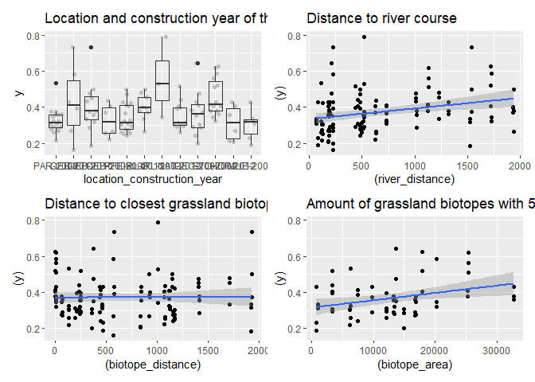

Analysis of Bauer et al. (unpublished) Beta diversity on dike
grasslands: <br> Temporal beta-diversity index (TBI) with all species
================
<b>Markus Bauer</b> <br>
<b>2023-01-16</b>

- <a href="#preparation" id="toc-preparation">Preparation</a>
- <a href="#statistics" id="toc-statistics">Statistics</a>
  - <a href="#data-exploration-step-2-6-7"
    id="toc-data-exploration-step-2-6-7">Data exploration (Step 2, 6, 7)</a>
    - <a href="#means-and-deviations" id="toc-means-and-deviations">Means and
      deviations</a>
    - <a href="#graphs-of-raw-data" id="toc-graphs-of-raw-data">Graphs of raw
      data</a>
    - <a href="#outliers-zero-inflation-transformations-step-1-3-4"
      id="toc-outliers-zero-inflation-transformations-step-1-3-4">Outliers,
      zero-inflation, transformations? (Step 1, 3, 4)</a>
    - <a href="#check-collinearity-part-1-step-5"
      id="toc-check-collinearity-part-1-step-5">Check collinearity part 1
      (Step 5)</a>
  - <a href="#models" id="toc-models">Models</a>
  - <a href="#model-check" id="toc-model-check">Model check</a>
    - <a href="#dharma" id="toc-dharma">DHARMa</a>
    - <a href="#check-collinearity-part-2-step-5"
      id="toc-check-collinearity-part-2-step-5">Check collinearity part 2
      (Step 5)</a>
  - <a href="#model-comparison" id="toc-model-comparison">Model
    comparison</a>
    - <a href="#r2-values" id="toc-r2-values"><i>R</i><sup>2</sup> values</a>
    - <a href="#aicc" id="toc-aicc">AICc</a>
  - <a href="#predicted-values" id="toc-predicted-values">Predicted
    values</a>
    - <a href="#summary-table" id="toc-summary-table">Summary table</a>
    - <a href="#forest-plot" id="toc-forest-plot">Forest plot</a>
    - <a href="#effect-sizes" id="toc-effect-sizes">Effect sizes</a>
- <a href="#session-info" id="toc-session-info">Session info</a>

<br/> <br/> <b>Markus Bauer</b>

Technichal University of Munich, TUM School of Life Sciences, Chair of
Restoration Ecology, Emil-Ramann-Straße 6, 85354 Freising, Germany

<markus1.bauer@tum.de>

ORCiD ID: [0000-0001-5372-4174](https://orcid.org/0000-0001-5372-4174)
<br> [Google
Scholar](https://scholar.google.de/citations?user=oHhmOkkAAAAJ&hl=de&oi=ao)
<br> GitHub: [markus1bauer](https://github.com/markus1bauer)

To compare different models, you only have to change the models in
section ‘Load models’

# Preparation

Temporal beta-diversity index (TBI) sensu Legendre (2019) Ecol Evol
[DOI: 10.1002/ece3.4984](https://doi.org/10.1002/ece3.4984)

Protocol of data exploration (Steps 1-8) used from Zuur et al. (2010)
Methods Ecol Evol [DOI:
10.1111/2041-210X.12577](https://doi.org/10.1111/2041-210X.12577)

#### Packages

``` r
library(here)
library(tidyverse)
library(ggbeeswarm)
library(patchwork)
library(blme)
library(DHARMa)
library(emmeans)
```

#### Load data

``` r
sites <- read_csv(here("data", "processed", "data_processed_sites_temporal.csv"),
                  col_names = TRUE, na = c("", "na", "NA"),
                  col_types =
                    cols(
                      .default = "?",
                      plot = "f",
                      block = "f",
                      comparison = "f",
                      location = "f",
                      location_construction_year = "f",
                      exposition = col_factor(levels = c("south", "north")),
                      orientation = col_factor(levels = c("land", "water"))
                    )) %>%
  filter(
    (comparison == "1718" | comparison == "1819" | comparison == "1921") &
      pool == "all" & presabu == "presence") %>%
  mutate(
    y = d,
    comparison = factor(comparison)
    ) %>%
  mutate(
    river_km_scaled = scale(river_km),
    river_distance_scaled = scale(river_distance),
    biotope_distance_scaled = scale(biotope_distance),
    biotope_area_scaled = scale(biotope_area)
    )
```

# Statistics

## Data exploration (Step 2, 6, 7)

### Means and deviations

``` r
Rmisc::CI(sites$y, ci = .95)
```

    ##     upper      mean     lower 
    ## 0.3924503 0.3719309 0.3514115

``` r
median(sites$y)
```

    ## [1] 0.3571

``` r
sd(sites$y)
```

    ## [1] 0.114958

``` r
quantile(sites$y, probs = c(0.05, 0.95), na.rm = TRUE)
```

    ##      5%     95% 
    ## 0.21788 0.58690

### Graphs of raw data

<!-- --><!-- --><!-- --><!-- -->

### Outliers, zero-inflation, transformations? (Step 1, 3, 4)

    ## # A tibble: 12 × 2
    ##    location_construction_year     n
    ##    <fct>                      <int>
    ##  1 PAR-2008                      18
    ##  2 OEB-2012                       6
    ##  3 OEB-2010                      12
    ##  4 OEB-2006                       6
    ##  5 PFE-2008                      18
    ##  6 IRL-2011                       9
    ##  7 IRL-2003                       3
    ##  8 NAT-2013                      12
    ##  9 DEG-2007                      12
    ## 10 STO-2002                      15
    ## 11 HOF-2012                       6
    ## 12 MUE-2007                       6

<!-- -->

### Check collinearity part 1 (Step 5)

Exclude r \> 0.7 <br> Dormann et al. 2013 Ecography [DOI:
10.1111/j.1600-0587.2012.07348.x](https://doi.org/10.1111/j.1600-0587.2012.07348.x)

``` r
sites %>%
  select(where(is.numeric), -b, -c, -d, -y, -ends_with("scaled")) %>%
  GGally::ggpairs(
    lower = list(continuous = "smooth_loess")
    ) +
  theme(strip.text = element_text(size = 7))
```

<!-- -->

``` r
sites <- sites %>%
  select(-biotope_area)
```

## Models

Only here you have to modify the script to compare other models

``` r
load(file = here("outputs", "models", "model_tbi_d_all_3.Rdata"))
load(file = here("outputs", "models", "model_tbi_d_all_5.Rdata"))
m_1 <- m3
m_2 <- m5
```

``` r
m_1@call
## blmer(formula = log(y) ~ comparison + exposition * pc1_soil + 
##     pc2_soil + pc3_soil + orientation + river_distance_scaled + 
##     river_km_scaled + biotope_distance_scaled + (1 | plot), data = sites, 
##     REML = FALSE, control = lmerControl(optimizer = "Nelder_Mead"), 
##     cov.prior = wishart)
m_2@call
## blmer(formula = log(y) ~ comparison + exposition + pc1_soil + 
##     pc2_soil + pc3_soil + orientation + river_distance_scaled + 
##     river_km_scaled + biotope_distance_scaled + (1 | plot), data = sites, 
##     REML = FALSE, control = lmerControl(optimizer = "Nelder_Mead"), 
##     cov.prior = wishart)
```

## Model check

### DHARMa

``` r
simulation_output_1 <- simulateResiduals(m_1, plot = TRUE)
```

<!-- -->

``` r
simulation_output_2 <- simulateResiduals(m_2, plot = TRUE)
```

<!-- -->

``` r
plotResiduals(simulation_output_1$scaledResiduals, sites$plot)
```

<!-- -->

``` r
plotResiduals(simulation_output_2$scaledResiduals, sites$plot)
```

<!-- -->

``` r
plotResiduals(simulation_output_1$scaledResiduals, sites$location)
```

<!-- -->

``` r
plotResiduals(simulation_output_2$scaledResiduals, sites$location)
```

<!-- -->

``` r
plotResiduals(simulation_output_1$scaledResiduals, sites$location_construction_year)
```

<!-- -->

``` r
plotResiduals(simulation_output_2$scaledResiduals, sites$location_construction_year)
```

<!-- -->

``` r
plotResiduals(simulation_output_1$scaledResiduals, sites$comparison)
```

<!-- -->

``` r
plotResiduals(simulation_output_2$scaledResiduals, sites$comparison)
```

<!-- -->

``` r
plotResiduals(simulation_output_1$scaledResiduals, sites$exposition)
```

<!-- -->

``` r
plotResiduals(simulation_output_2$scaledResiduals, sites$exposition)
```

<!-- -->

``` r
plotResiduals(simulation_output_1$scaledResiduals, sites$orientation)
```

<!-- -->

``` r
plotResiduals(simulation_output_2$scaledResiduals, sites$orientation)
```

<!-- -->

``` r
plotResiduals(simulation_output_1$scaledResiduals, sites$pc1_soil)
```

<!-- -->

``` r
plotResiduals(simulation_output_2$scaledResiduals, sites$pc1_soil)
```

<!-- -->

``` r
plotResiduals(simulation_output_1$scaledResiduals, sites$pc2_soil)
```

<!-- -->

``` r
plotResiduals(simulation_output_2$scaledResiduals, sites$pc2_soil)
```

<!-- -->

``` r
plotResiduals(simulation_output_1$scaledResiduals, sites$pc3_soil)
```

<!-- -->

``` r
plotResiduals(simulation_output_2$scaledResiduals, sites$pc3_soil)
```

<!-- -->

``` r
plotResiduals(simulation_output_1$scaledResiduals, sites$river_km_scaled)
```

<!-- -->

``` r
plotResiduals(simulation_output_2$scaledResiduals, sites$river_km_scaled)
```

<!-- -->

``` r
plotResiduals(simulation_output_1$scaledResiduals, sites$river_distance_scaled)
```

<!-- -->

``` r
plotResiduals(simulation_output_2$scaledResiduals, sites$river_distance_scaled)
```

<!-- -->

``` r
plotResiduals(simulation_output_1$scaledResiduals, sites$biotope_distance_scaled)
```

<!-- -->

``` r
plotResiduals(simulation_output_2$scaledResiduals, sites$biotope_distance_scaled)
```

<!-- -->

### Check collinearity part 2 (Step 5)

Remove VIF \> 3 or \> 10 –\> location_construction_year removed <br>
Zuur et al. 2010 Methods Ecol Evol [DOI:
10.1111/j.2041-210X.2009.00001.x](https://doi.org/10.1111/j.2041-210X.2009.00001.x)

``` r
car::vif(m_1)
```

    ##                             GVIF Df GVIF^(1/(2*Df))
    ## comparison              1.000000  2        1.000000
    ## exposition              1.094406  1        1.046139
    ## pc1_soil                3.292172  1        1.814434
    ## pc2_soil                1.850376  1        1.360285
    ## pc3_soil                1.541470  1        1.241560
    ## orientation             1.296347  1        1.138572
    ## river_distance_scaled   1.259014  1        1.122058
    ## river_km_scaled         1.393298  1        1.180381
    ## biotope_distance_scaled 2.356306  1        1.535026
    ## exposition:pc1_soil     2.934371  1        1.713000

``` r
car::vif(m_2)
```

    ##                             GVIF Df GVIF^(1/(2*Df))
    ## comparison              1.000000  2        1.000000
    ## exposition              1.092480  1        1.045217
    ## pc1_soil                1.380381  1        1.174896
    ## pc2_soil                1.850356  1        1.360278
    ## pc3_soil                1.519687  1        1.232756
    ## orientation             1.284741  1        1.133464
    ## river_distance_scaled   1.254651  1        1.120112
    ## river_km_scaled         1.370962  1        1.170881
    ## biotope_distance_scaled 2.315701  1        1.521743

## Model comparison

### <i>R</i><sup>2</sup> values

``` r
MuMIn::r.squaredGLMM(m_1)
## Warning: 'r.squaredGLMM' now calculates a revised statistic. See the help page.
##            R2m       R2c
## [1,] 0.3021777 0.4204032
MuMIn::r.squaredGLMM(m_2)
##            R2m       R2c
## [1,] 0.2807954 0.4184419
```

### AICc

Use AICc and not AIC since ratio n/K \< 40 <br> Burnahm & Anderson 2002
p. 66 ISBN: 978-0-387-95364-9

``` r
MuMIn::AICc(m_1, m_2) %>%
  arrange(AICc)
##     df     AICc
## m_1 14 35.03262
## m_2 13 35.39141
```

## Predicted values

### Summary table

``` r
summary(m_2)
```

    ## Cov prior  : plot ~ wishart(df = 3.5, scale = Inf, posterior.scale = cov, common.scale = TRUE)
    ## Prior dev  : 2.1615
    ## 
    ## Linear mixed model fit by maximum likelihood  ['blmerMod']
    ## Formula: log(y) ~ comparison + exposition + pc1_soil + pc2_soil + pc3_soil +  
    ##     orientation + river_distance_scaled + river_km_scaled + biotope_distance_scaled +  
    ##     (1 | plot)
    ##    Data: sites
    ## Control: lmerControl(optimizer = "Nelder_Mead")
    ## 
    ##      AIC      BIC   logLik deviance df.resid 
    ##     32.1     68.6     -3.0      6.1      110 
    ## 
    ## Scaled residuals: 
    ##     Min      1Q  Median      3Q     Max 
    ## -2.4751 -0.6716 -0.0092  0.5294  2.8024 
    ## 
    ## Random effects:
    ##  Groups   Name        Variance Std.Dev.
    ##  plot     (Intercept) 0.01217  0.1103  
    ##  Residual             0.05143  0.2268  
    ## Number of obs: 123, groups:  plot, 41
    ## 
    ## Fixed effects:
    ##                          Estimate Std. Error t value
    ## (Intercept)             -1.040778   0.057759 -18.019
    ## comparison1819          -0.113915   0.050088  -2.274
    ## comparison1921           0.038354   0.050088   0.766
    ## expositionnorth         -0.095529   0.056049  -1.704
    ## pc1_soil                -0.022757   0.042126  -0.540
    ## pc2_soil                 0.043235   0.048774   0.886
    ## pc3_soil                -0.002089   0.044201  -0.047
    ## orientationwater         0.157981   0.060636   2.605
    ## river_distance_scaled    0.092536   0.030075   3.077
    ## river_km_scaled         -0.004167   0.031438  -0.133
    ## biotope_distance_scaled  0.002545   0.040858   0.062
    ## 
    ## Correlation of Fixed Effects:
    ##             (Intr) cm1819 cm1921 expstn pc1_sl pc2_sl pc3_sl ornttn rvr_d_
    ## comprsn1819 -0.434                                                        
    ## comprsn1921 -0.434  0.500                                                 
    ## expostnnrth -0.528  0.000  0.000                                          
    ## pc1_soil    -0.121  0.000  0.000 -0.139                                   
    ## pc2_soil    -0.124  0.000  0.000  0.077  0.100                            
    ## pc3_soil    -0.019  0.000  0.000 -0.105  0.067 -0.312                     
    ## orienttnwtr -0.581  0.000  0.000  0.153  0.358  0.174  0.130              
    ## rvr_dstnc_s -0.049  0.000  0.000  0.033  0.244  0.231 -0.253  0.066       
    ## rvr_km_scld  0.082  0.000  0.000 -0.008 -0.275 -0.333  0.015 -0.153 -0.056
    ## btp_dstnc_s -0.105  0.000  0.000  0.113 -0.007  0.632 -0.460  0.105  0.023
    ##             rvr_k_
    ## comprsn1819       
    ## comprsn1921       
    ## expostnnrth       
    ## pc1_soil          
    ## pc2_soil          
    ## pc3_soil          
    ## orienttnwtr       
    ## rvr_dstnc_s       
    ## rvr_km_scld       
    ## btp_dstnc_s -0.397

### Forest plot

``` r
dotwhisker::dwplot(
  list(m_1, m_2),
  ci = 0.95,
  show_intercept = FALSE,
  vline = geom_vline(xintercept = 0, colour = "grey60", linetype = 2)) +
  xlim(-0.3, 0.35) +
  theme_classic()
```

<!-- -->

### Effect sizes

Effect sizes of chosen model just to get exact values of means etc. if
necessary.

``` r
(emm <- emmeans(
  m_2,
  revpairwise ~ comparison,
  type = "response"
  ))
```

    ## $emmeans
    ##  comparison response     SE  df lower.CL upper.CL
    ##  1718          0.364 0.0154 134    0.335    0.396
    ##  1819          0.325 0.0137 134    0.299    0.354
    ##  1921          0.379 0.0160 134    0.348    0.412
    ## 
    ## Results are averaged over the levels of: exposition, orientation 
    ## Degrees-of-freedom method: kenward-roger 
    ## Confidence level used: 0.95 
    ## Intervals are back-transformed from the log scale 
    ## 
    ## $contrasts
    ##  contrast                        ratio     SE   df null t.ratio p.value
    ##  comparison1819 / comparison1718 0.892 0.0454 85.5    1  -2.237  0.0707
    ##  comparison1921 / comparison1718 1.039 0.0529 85.5    1   0.753  0.7325
    ##  comparison1921 / comparison1819 1.164 0.0593 85.5    1   2.990  0.0101
    ## 
    ## Results are averaged over the levels of: exposition, orientation 
    ## Degrees-of-freedom method: kenward-roger 
    ## P value adjustment: tukey method for comparing a family of 3 estimates 
    ## Tests are performed on the log scale

``` r
plot(emm, comparison = TRUE)
```

<!-- -->

# Session info

    ## R version 4.2.2 (2022-10-31 ucrt)
    ## Platform: x86_64-w64-mingw32/x64 (64-bit)
    ## Running under: Windows 10 x64 (build 22621)
    ## 
    ## Matrix products: default
    ## 
    ## locale:
    ## [1] LC_COLLATE=German_Germany.utf8  LC_CTYPE=German_Germany.utf8   
    ## [3] LC_MONETARY=German_Germany.utf8 LC_NUMERIC=C                   
    ## [5] LC_TIME=German_Germany.utf8    
    ## 
    ## attached base packages:
    ## [1] stats     graphics  grDevices utils     datasets  methods   base     
    ## 
    ## other attached packages:
    ##  [1] emmeans_1.8.3    DHARMa_0.4.6     blme_1.0-5       lme4_1.1-31     
    ##  [5] Matrix_1.5-1     patchwork_1.1.2  ggbeeswarm_0.7.1 forcats_0.5.2   
    ##  [9] stringr_1.5.0    dplyr_1.0.10     purrr_1.0.1      readr_2.1.3     
    ## [13] tidyr_1.2.1      tibble_3.1.8     ggplot2_3.4.0    tidyverse_1.3.2 
    ## [17] here_1.0.1      
    ## 
    ## loaded via a namespace (and not attached):
    ##   [1] readxl_1.4.1        backports_1.4.1     plyr_1.8.8         
    ##   [4] splines_4.2.2       gap.datasets_0.0.5  digest_0.6.31      
    ##   [7] foreach_1.5.2       htmltools_0.5.4     fansi_1.0.3        
    ##  [10] magrittr_2.0.3      googlesheets4_1.0.1 doParallel_1.0.17  
    ##  [13] tzdb_0.3.0          modelr_0.1.10       vroom_1.6.0        
    ##  [16] sandwich_3.0-2      timechange_0.2.0    colorspace_2.0-3   
    ##  [19] rvest_1.0.3         haven_2.5.1         xfun_0.36          
    ##  [22] crayon_1.5.2        jsonlite_1.8.4      zoo_1.8-11         
    ##  [25] iterators_1.0.14    glue_1.6.2          gtable_0.3.1       
    ##  [28] gargle_1.2.1        car_3.1-1           abind_1.4-5        
    ##  [31] scales_1.2.1        mvtnorm_1.1-3       DBI_1.1.3          
    ##  [34] GGally_2.1.2        Rcpp_1.0.9          performance_0.10.2 
    ##  [37] xtable_1.8-4        ggstance_0.3.6      bit_4.0.5          
    ##  [40] stats4_4.2.2        datawizard_0.6.5    httr_1.4.4         
    ##  [43] RColorBrewer_1.1-3  lavaan_0.6-13       ellipsis_0.3.2     
    ##  [46] pkgconfig_2.0.3     reshape_0.8.9       farver_2.1.1       
    ##  [49] qgam_1.3.4          dbplyr_2.2.1        utf8_1.2.2         
    ##  [52] effectsize_0.8.2    tidyselect_1.2.0    labeling_0.4.2     
    ##  [55] rlang_1.0.6         later_1.3.0         munsell_0.5.0      
    ##  [58] cellranger_1.1.0    tools_4.2.2         cli_3.6.0          
    ##  [61] generics_0.1.3      broom_1.0.2         evaluate_0.19      
    ##  [64] fastmap_1.1.0       yaml_2.3.6          knitr_1.41         
    ##  [67] bit64_4.0.5         fs_1.5.2            nlme_3.1-161       
    ##  [70] mime_0.12           xml2_1.3.3          nonnest2_0.5-5     
    ##  [73] pbkrtest_0.5.1      gap_1.4-2           compiler_4.2.2     
    ##  [76] rstudioapi_0.14     beeswarm_0.4.0      reprex_2.0.2       
    ##  [79] pbivnorm_0.6.0      stringi_1.7.12      highr_0.10         
    ##  [82] parameters_0.20.1   lattice_0.20-45     nloptr_2.0.3       
    ##  [85] vctrs_0.5.1         CompQuadForm_1.4.3  pillar_1.8.1       
    ##  [88] lifecycle_1.0.3     estimability_1.4.1  insight_0.18.8     
    ##  [91] httpuv_1.6.7        R6_2.5.1            Rmisc_1.5.1        
    ##  [94] MuMIn_1.47.1        promises_1.2.0.1    dotwhisker_0.7.4   
    ##  [97] vipor_0.4.5         codetools_0.2-18    boot_1.3-28        
    ## [100] MASS_7.3-58.1       assertthat_0.2.1    rprojroot_2.0.3    
    ## [103] withr_2.5.0         mnormt_2.1.1        mgcv_1.8-41        
    ## [106] bayestestR_0.13.0   parallel_4.2.2      hms_1.1.2          
    ## [109] grid_4.2.2          coda_0.19-4         minqa_1.2.5        
    ## [112] rmarkdown_2.19      carData_3.0-5       googledrive_2.0.0  
    ## [115] numDeriv_2016.8-1.1 shiny_1.7.4         lubridate_1.9.0
