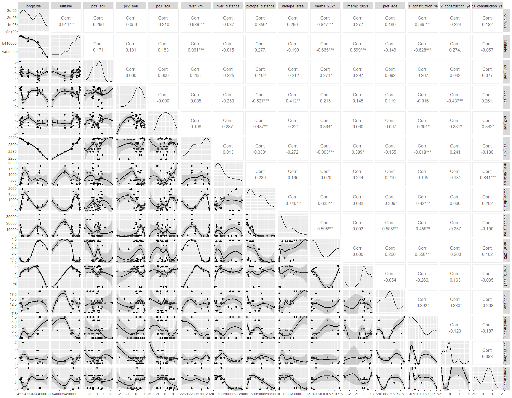
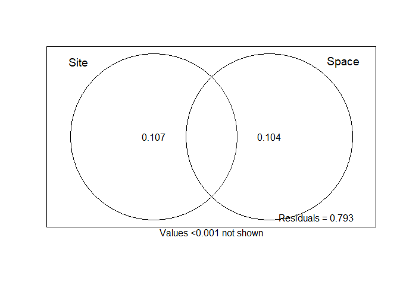

Analysis of Bauer et al. (unpublished) Beta diversity on dike
grasslands: <br> Spatial variation 2021
================
<b>Markus Bauer</b> <br>
<b>2023-01-17</b>

- <a href="#preparation" id="toc-preparation">Preparation</a>
- <a href="#statistics" id="toc-statistics">Statistics</a>
  - <a href="#calculate-beta-diversity"
    id="toc-calculate-beta-diversity">Calculate beta diversity</a>
    - <a href="#check-collinearity" id="toc-check-collinearity">Check
      collinearity</a>
    - <a href="#calculate-baselga-presence-absence"
      id="toc-calculate-baselga-presence-absence">Calculate: Baselga
      presence-absence</a>
  - <a href="#db-rda-replacement-component"
    id="toc-db-rda-replacement-component">db-RDA: Replacement component</a>
    - <a href="#check-linear-trend-in-data"
      id="toc-check-linear-trend-in-data">Check linear trend in data</a>
    - <a href="#full-model" id="toc-full-model">Full model</a>
    - <a href="#forward-selection-soil"
      id="toc-forward-selection-soil">Forward selection: Soil</a>
    - <a href="#forward-selection-space"
      id="toc-forward-selection-space">Forward selection: Space</a>
    - <a href="#forward-selection-history"
      id="toc-forward-selection-history">Forward selection: History</a>
    - <a href="#variation-partitioning"
      id="toc-variation-partitioning">Variation partitioning</a>
    - <a href="#partial-db-rda" id="toc-partial-db-rda">Partial db-RDA</a>
  - <a href="#db-rda-nestedness-component"
    id="toc-db-rda-nestedness-component">db-RDA: Nestedness component</a>
    - <a href="#full-model-1" id="toc-full-model-1">Full model</a>
    - <a href="#forward-selection" id="toc-forward-selection">Forward
      selection</a>

<br/> <br/> <b>Markus Bauer</b>

Technichal University of Munich, TUM School of Life Sciences, Chair of
Restoration Ecology, Emil-Ramann-Straße 6, 85354 Freising, Germany

<markus1.bauer@tum.de>

ORCiD ID: [0000-0001-5372-4174](https://orcid.org/0000-0001-5372-4174)
<br> [Google
Scholar](https://scholar.google.de/citations?user=oHhmOkkAAAAJ&hl=de&oi=ao)
<br> GitHub: [markus1bauer](https://github.com/markus1bauer)

To compare different models, you only have to change the models in
section ‘Load models’

# Preparation

Borcard, Gillet & Legendre (2018) Numerical Ecology with R. 2nd edition.
Springer, Cham. [DOI:
10.1007/978-3-319-71404-2](https://doi.org/10.1007/978-3-319-71404-2)
Chapter 6.3

#### Packages

``` r
library(here)
library(tidyverse)
library(vegan)
library(adespatial)
```

#### Load data

``` r
sites <- read_csv(here("data", "processed", "data_processed_sites_spatial.csv"),
  col_names = TRUE,
  na = c("na", "NA"), col_types =
    cols(
      .default = "?",
      id = "f",
      location_abb = "f",
      block = "f",
      plot = "f",
      exposition = "f",
      orientation = "f",
      location_construction_year = "f"
    )) %>%
  filter(survey_year == 2021) %>%
  select(
    id, plot, block, longitude, latitude,
    botanist, location_construction_year, construction_year,
    exposition, orientation, pc1_soil, pc2_soil, pc3_soil,
    location_abb, river_km, river_distance, biotope_distance, biotope_area,
    mem1_2021, mem2_2021,
    survey_year, plot_age, pc1_construction_year, pc2_construction_year,
    pc3_construction_year,
    accumulated_cover
    ) %>%
  mutate(
    survey_year_factor = as_factor(survey_year),
    exposition_numeric = as.double(exposition),
    orientation_numeric = as.double(orientation),
    location_abb_numeric = as.double(location_abb),
    botanist_numeric = as.double(as_factor(botanist)),
    biotope_area = if_else(is.na(biotope_area), 0, biotope_area)
  )

species <- read_csv(here("data", "processed", "data_processed_species.csv"),
  col_names = TRUE,
  na = c("na", "NA", ""), col_types =
    cols(
      .default = "d",
      name = "f"
    )) %>%
  mutate(across(where(is.numeric), ~ replace(., is.na(.), 0))) %>%
  pivot_longer(-name, names_to = "id", values_to = "value") %>%
  pivot_wider(id, names_from = "name", values_from = "value") %>%
  semi_join(sites, by = "id") %>%
  arrange(id) %>%
  column_to_rownames("id")

sites <- sites %>%
  column_to_rownames("id")
```

# Statistics

## Calculate beta diversity

### Check collinearity

Exclude r \> 0.7 <br> Dormann et al. 2013 Ecography [DOI:
10.1111/j.1600-0587.2012.07348.x](https://doi.org/10.1111/j.1600-0587.2012.07348.x)

``` r
sites %>%
  select(
    where(is.numeric), -ends_with("numeric"),
    -accumulated_cover, -construction_year, -survey_year,
    ) %>%
  GGally::ggpairs(lower = list(continuous = "smooth_loess"))
```

<!-- -->

→ Remove latitude, longitude, biotope_area, mem1_2021,
pc3_construction_year

``` r
sites_soil <- sites %>%
  select(pc1_soil, pc2_soil, pc3_soil, exposition_numeric, orientation_numeric)
sites_space <- sites %>%
  select(location_abb_numeric, river_distance, river_km, biotope_distance, mem2_2021)
sites_history <- sites %>%
  select(plot_age, pc1_construction_year, pc2_construction_year)
```

### Calculate: Baselga presence-absence

``` r
beta <- beta.div.comp(species, coef = "BS", quant = FALSE)
beta$Note
```

    ## [1] "Baselga family, Sorensen"

``` r
beta$part
```

    ##      BDtotal         Repl          Nes Repl/BDtotal  Nes/BDtotal 
    ##   0.34203727   0.29205484   0.04998243   0.85386846   0.14613154

``` r
beta_total <- beta$D %>% # = Soerensen dissimilarity
  as.matrix() %>%
  as.data.frame()
beta_substitution <- beta$repl %>% # = Replacement / Simpson dissimilarity
  as.matrix()
beta_subsets <- beta$rich %>% # = Nestedness
  as.matrix()
```

## db-RDA: Replacement component

### Check linear trend in data

m1 \<- dbrda(beta_substitution \~ longitude + latitude, data = sites)
anova(m1) beta_substitution_detrended \<- resid(lm(beta_substitution \~
longitude + latitude, data = sites)) → this trend is captured by
river_km

### Full model

``` r
m1 <- dbrda(
  beta_substitution ~
    pc1_soil + pc2_soil + pc3_soil + exposition + orientation +
    location_abb + river_km + river_distance + biotope_distance + mem2_2021 +
    plot_age + pc1_construction_year + pc2_construction_year,
  data = sites
  )
anova(m1, permutations = how(nperm = 9999))
```

    ## Permutation test for dbrda under reduced model
    ## Permutation: free
    ## Number of permutations: 9999
    ## 
    ## Model: dbrda(formula = beta_substitution ~ pc1_soil + pc2_soil + pc3_soil + exposition + orientation + location_abb + river_km + river_distance + biotope_distance + mem2_2021 + plot_age + pc1_construction_year + pc2_construction_year, data = sites)
    ##          Df SumOfSqs      F Pr(>F)    
    ## Model    20   5.2980 2.6447  1e-04 ***
    ## Residual 20   2.0032                  
    ## ---
    ## Signif. codes:  0 '***' 0.001 '**' 0.01 '*' 0.05 '.' 0.1 ' ' 1

``` r
(r2adj <- RsquareAdj(m1)$adj.r.squared)
```

    ## [1] 0.4512594

### Forward selection: Soil

``` r
m1 <- dbrda(
  beta_substitution ~ pc1_soil + pc2_soil + pc3_soil + exposition + orientation,
  data = sites
  )
r2adj <- RsquareAdj(m1)$adj.r.squared
sel <- forward.sel(
  beta_substitution,
  sites_soil,
  adjR2thresh = r2adj,
  nperm = 9999
  )
```

    ## Testing variable 1
    ## Testing variable 2
    ## Testing variable 3
    ## Testing variable 4
    ## Procedure stopped (adjR2thresh criteria) adjR2cum = 0.169255 with 4 variables (> 0.157952)

``` r
sel$p_adj <- p.adjust(sel$pvalue, method = "holm", n = ncol(sites_soil))
sel # https://www.davidzeleny.net/anadat-r/doku.php/en:forward_sel_examples
```

    ##            variables order         R2      R2Cum   AdjR2Cum        F pvalue
    ## 1 exposition_numeric     4 0.07614705 0.07614705 0.05245851 3.214510 0.0058
    ## 2           pc1_soil     1 0.07827414 0.15442119 0.10991704 3.517611 0.0030
    ## 3           pc3_soil     3 0.05447642 0.20889761 0.14475418 2.547872 0.0094
    ##    p_adj
    ## 1 0.0232
    ## 2 0.0150
    ## 3 0.0282

``` r
sites_soil_selected <- sites %>%
  select(pc1_soil, exposition_numeric, pc3_soil)
```

### Forward selection: Space

``` r
m1 <- dbrda(
  beta_substitution ~ location_abb + river_km + river_distance +
    biotope_distance + mem2_2021,
  data = sites
  )
r2adj <- RsquareAdj(m1)$adj.r.squared
sel <- forward.sel(
  beta_substitution,
  sites_space,
  adjR2thresh = r2adj,
  nperm = 9999
  )
```

    ## Testing variable 1
    ## Testing variable 2
    ## Testing variable 3
    ## Procedure stopped (alpha criteria): pvalue for variable 3 is 0.130300 (> 0.050000)

``` r
sel$p_adj <- p.adjust(sel$pvalue, method = "holm", n = ncol(sites_space))
sel # https://www.davidzeleny.net/anadat-r/doku.php/en:forward_sel_examples
```

    ##          variables order         R2      R2Cum   AdjR2Cum        F pvalue
    ## 1 biotope_distance     4 0.05949809 0.05949809 0.03538265 2.467220 0.0186
    ## 2   river_distance     2 0.06066989 0.12016798 0.07386103 2.620336 0.0153
    ##    p_adj
    ## 1 0.0765
    ## 2 0.0765

``` r
sites_space_selected <- sites %>%
  select(river_distance, biotope_distance)
```

### Forward selection: History

``` r
m1 <- dbrda(
  beta_substitution ~ plot_age + pc1_construction_year + pc2_construction_year,
  data = sites
  )
r2adj <- RsquareAdj(m1)$adj.r.squared
#sel <- forward.sel(
#  beta_substitution,
#  sites_history,
#  adjR2thresh = r2adj,
#  nperm = 9999
#  )
```

→ No variables could be selected

### Variation partitioning

``` r
m1_substitution_varpart <- varpart(
  beta_substitution, sites_soil_selected, sites_space_selected
)
plot(
  m1_substitution_varpart,
  Xnames = c("Site", "Space"),
  cutoff = 0.001, digits = 2, bg = NA
  )
```

<!-- -->

### Partial db-RDA

#### Soil

``` r
m1_substitution <- dbrda(
  beta_substitution ~ pc1_soil + exposition + pc3_soil +
    Condition(river_distance + biotope_distance),
data = sites
)
anova(m1_substitution, permutations = how(nperm = 9999))
```

    ## Permutation test for dbrda under reduced model
    ## Permutation: free
    ## Number of permutations: 9999
    ## 
    ## Model: dbrda(formula = beta_substitution ~ pc1_soil + exposition + pc3_soil + Condition(river_distance + biotope_distance), data = sites)
    ##          Df SumOfSqs      F Pr(>F)    
    ## Model     3   1.1762 2.7084  2e-04 ***
    ## Residual 35   5.0665                  
    ## ---
    ## Signif. codes:  0 '***' 0.001 '**' 0.01 '*' 0.05 '.' 0.1 ' ' 1

``` r
RsquareAdj(m1_substitution)
```

    ## $r.squared
    ## [1] 0.1610963
    ## 
    ## $adj.r.squared
    ## [1] 0.1069646

#### Space

``` r
m1_substitution <- dbrda(
  beta_substitution ~ river_distance + biotope_distance +
    Condition(pc1_soil + exposition + pc3_soil),
  data = sites
  )
anova(m1_substitution, permutations = how(nperm = 9999))
```

    ## Permutation test for dbrda under reduced model
    ## Permutation: free
    ## Number of permutations: 9999
    ## 
    ## Model: dbrda(formula = beta_substitution ~ river_distance + biotope_distance + Condition(pc1_soil + exposition + pc3_soil), data = sites)
    ##          Df SumOfSqs      F Pr(>F)    
    ## Model     2   0.9905 3.4211  1e-04 ***
    ## Residual 35   5.0665                  
    ## ---
    ## Signif. codes:  0 '***' 0.001 '**' 0.01 '*' 0.05 '.' 0.1 ' ' 1

``` r
RsquareAdj(m1_substitution)
```

    ## $r.squared
    ## [1] 0.1356587
    ## 
    ## $adj.r.squared
    ## [1] 0.1037897

#### PC1_soil

``` r
m1_substitution <- dbrda(
  beta_substitution ~ pc1_soil +
  Condition(exposition + pc3_soil + river_distance + biotope_distance),
  data = sites
  )
anova(m1_substitution, permutations = how(nperm = 9999))
```

    ## Permutation test for dbrda under reduced model
    ## Permutation: free
    ## Number of permutations: 9999
    ## 
    ## Model: dbrda(formula = beta_substitution ~ pc1_soil + Condition(exposition + pc3_soil + river_distance + biotope_distance), data = sites)
    ##          Df SumOfSqs      F Pr(>F)
    ## Model     1   0.2470 1.7066 0.1125
    ## Residual 35   5.0665

``` r
RsquareAdj(m1_substitution)
```

    ## $r.squared
    ## [1] 0.03383549
    ## 
    ## $adj.r.squared
    ## [1] 0.01556541

#### Exposition

``` r
m1_substitution <- dbrda(
  beta_substitution ~ exposition +
  Condition(pc1_soil + pc3_soil + river_distance + biotope_distance),
  data = sites
  )
anova(m1_substitution, permutations = how(nperm = 9999))
```

    ## Permutation test for dbrda under reduced model
    ## Permutation: free
    ## Number of permutations: 9999
    ## 
    ## Model: dbrda(formula = beta_substitution ~ exposition + Condition(pc1_soil + pc3_soil + river_distance + biotope_distance), data = sites)
    ##          Df SumOfSqs    F Pr(>F)    
    ## Model     1   0.7600 5.25  1e-04 ***
    ## Residual 35   5.0665                
    ## ---
    ## Signif. codes:  0 '***' 0.001 '**' 0.01 '*' 0.05 '.' 0.1 ' ' 1

``` r
RsquareAdj(m1_substitution)
```

    ## $r.squared
    ## [1] 0.1040901
    ## 
    ## $adj.r.squared
    ## [1] 0.09362607

#### PC3_soil

``` r
m1_substitution <- dbrda(
  beta_substitution ~ pc3_soil +
  Condition(pc1_soil + exposition + river_distance + biotope_distance),
  data = sites
  )
anova(m1_substitution, permutations = how(nperm = 9999))
```

    ## Permutation test for dbrda under reduced model
    ## Permutation: free
    ## Number of permutations: 9999
    ## 
    ## Model: dbrda(formula = beta_substitution ~ pc3_soil + Condition(pc1_soil + exposition + river_distance + biotope_distance), data = sites)
    ##          Df SumOfSqs      F Pr(>F)  
    ## Model     1   0.3247 2.2428 0.0287 *
    ## Residual 35   5.0665                
    ## ---
    ## Signif. codes:  0 '***' 0.001 '**' 0.01 '*' 0.05 '.' 0.1 ' ' 1

``` r
RsquareAdj(m1_substitution)
```

    ## $r.squared
    ## [1] 0.04446699
    ## 
    ## $adj.r.squared
    ## [1] 0.02737818

#### Distance to river

``` r
m1_substitution <- dbrda(
  beta_substitution ~ river_distance +
  Condition(pc1_soil + exposition + pc3_soil + biotope_distance),
  data = sites
  )
anova(m1_substitution, permutations = how(nperm = 9999))
```

    ## Permutation test for dbrda under reduced model
    ## Permutation: free
    ## Number of permutations: 9999
    ## 
    ## Model: dbrda(formula = beta_substitution ~ river_distance + Condition(pc1_soil + exposition + pc3_soil + biotope_distance), data = sites)
    ##          Df SumOfSqs      F Pr(>F)    
    ## Model     1   0.5208 3.5976  2e-04 ***
    ## Residual 35   5.0665                  
    ## ---
    ## Signif. codes:  0 '***' 0.001 '**' 0.01 '*' 0.05 '.' 0.1 ' ' 1

``` r
RsquareAdj(m1_substitution)
```

    ## $r.squared
    ## [1] 0.07132755
    ## 
    ## $adj.r.squared
    ## [1] 0.05722324

#### Distance to closest biotope

``` r
m1_substitution <- dbrda(
  beta_substitution ~ biotope_distance +
  Condition(pc1_soil + exposition + pc3_soil + river_distance),
  data = sites
  )
anova(m1_substitution, permutations = how(nperm = 9999))
```

    ## Permutation test for dbrda under reduced model
    ## Permutation: free
    ## Number of permutations: 9999
    ## 
    ## Model: dbrda(formula = beta_substitution ~ biotope_distance + Condition(pc1_soil + exposition + pc3_soil + river_distance), data = sites)
    ##          Df SumOfSqs      F Pr(>F)    
    ## Model     1   0.4613 3.1866  8e-04 ***
    ## Residual 35   5.0665                  
    ## ---
    ## Signif. codes:  0 '***' 0.001 '**' 0.01 '*' 0.05 '.' 0.1 ' ' 1

``` r
RsquareAdj(m1_substitution)
```

    ## $r.squared
    ## [1] 0.06318005
    ## 
    ## $adj.r.squared
    ## [1] 0.04817047

## db-RDA: Nestedness component

### Full model

``` r
m1 <- dbrda(
  beta_subsets ~ pc1_soil + pc2_soil + pc3_soil + exposition + orientation +
  location_abb + river_km + river_distance + biotope_distance + mem2_2021 +
  plot_age + pc1_construction_year + pc2_construction_year,
  data = sites
  )
anova(m1, permutations = how(nperm = 999))
```

    ## Permutation test for dbrda under reduced model
    ## Permutation: free
    ## Number of permutations: 999
    ## 
    ## Model: dbrda(formula = beta_subsets ~ pc1_soil + pc2_soil + pc3_soil + exposition + orientation + location_abb + river_km + river_distance + biotope_distance + mem2_2021 + plot_age + pc1_construction_year + pc2_construction_year, data = sites)
    ##          Df SumOfSqs      F Pr(>F)
    ## Model    20  0.12281 0.5293  0.861
    ## Residual 20  0.23202

``` r
(r2adj <- RsquareAdj(m1)$adj.r.squared)
```

    ## [1] -0.3077811

### Forward selection

→ no forward selection because full model is not significant
